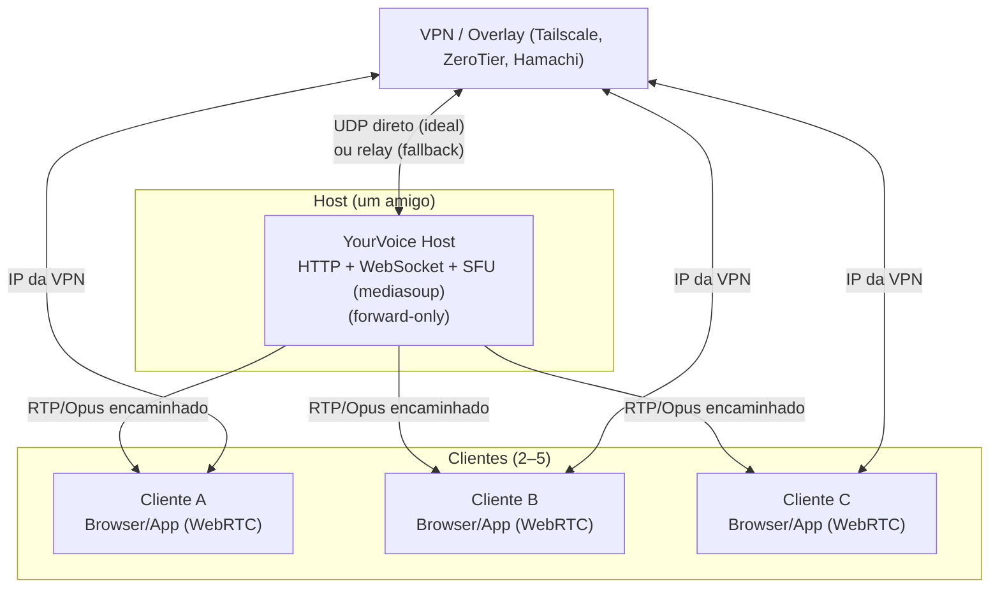

# YourVoice

Chat de voz auto-hosteado para grupos pequenos (2–5 pessoas), pensado para uso durante jogos: **latência mínima**, **impacto mínimo em FPS** e **sem servidor público obrigatório**.

O modelo de uso é “Minecraft via VPN”: um amigo hosteia o servidor na própria máquina e os demais se conectam usando o **IP/hostname da VPN** (Tailscale/ZeroTier/Hamachi).

---

## Objetivos

* Voz em tempo real com latência baixa (limitada principalmente pela rede)
* Cliente extremamente leve (preservar FPS)
* Host caseiro atrás de CGNAT (via VPN/overlay)
* Simplicidade operacional: subir, compartilhar IP da VPN, entrar

## Não objetivos (MVP)

* Escalar para dezenas de pessoas
* Gravação e armazenamento de áudio
* Mixagem/transcodificação no servidor
* Recursos “social” (avatars, chat de texto, feeds, etc.)

---

## Arquitetura

### Componentes

* **Cliente (browser):** WebRTC nativo
* **Host (um amigo):** servidor do grupo com

  * **Sinalização** (WebSocket) para negociação/controle
  * **SFU (Selective Forwarding Unit) forward-only** para encaminhar áudio
* **Rede:** VPN/overlay privada (estilo Hamachi)

### Por que SFU forward-only

* O host **não mixa** e **não transcodifica**
* O host basicamente **encaminha pacotes**
* CPU do host permanece baixa; gargalo tende a ser **upload**
* O cliente continua leve: WebRTC nativo faz o trabalho pesado de forma otimizada

---

## Áudio

* **Codec:** Opus (voz)
* **Bitrate:** moderado (ex.: 24–48 kbps por participante, ajustável)
* **VAD/DTX:** habilitar para reduzir tráfego quando não há fala
* **AEC (eco):** habilitar quando necessário (alto-falante); com headset pode ser reduzido

---

## Rede e VPN (overlay)

### Requisito mínimo

YourVoice funciona com **qualquer VPN/overlay** que forneça:

* conectividade IP entre os amigos
* UDP liberado (ideal para baixa latência)
* preferência por caminho direto, evitando relay quando possível

### Latência: a regra de ouro

A maior fonte de latência geralmente é o caminho de rede.

* Priorizar **conexão direta UDP (direct)** entre cliente e host
* Relay deve ser apenas fallback

### Tailscale, ZeroTier, Hamachi

* **Tailscale:** ótima visibilidade/diagnóstico de conexão (direct vs relay) e fallback via DERP quando necessário.
* **ZeroTier/Hamachi:** podem funcionar muito bem, especialmente para grupos 2–5, mas a latência pode piorar se o tráfego cair em relay fora do Brasil.

Observação importante:

* VPNs que suportam muitos devices “de graça” podem ser atraentes, mas se não tiverem um fallback/relay próximo, o impacto de latência em voz pode ser perceptível.

---

## Modos de fala

O cliente deve suportar:

* **Microfone aberto (always-on)**
* **Push-to-talk (PTT)**

No web puro, PTT funciona bem como “push-to-talk dentro da aba”, mas atalhos globais (fora do navegador) podem ser limitados.

---

## UX mínima (MVP)

Fluxo mínimo:

1. Campo **Sala** (string simples; ex.: `amigos`)
2. Campo **Nome** (pode auto-preencher)
3. Botão **Entrar**
4. Controles:

   * **Mute**
   * **Modo** (Aberto/PTT)
   * **Volume global**

---

## Distribuição

### Decisão: web puro

O cliente é **web puro**, servido pelo próprio host.

* Não existe servidor central do desenvolvedor
* O host roda tudo localmente (UI + sinalização + SFU)
* Os demais acessam no navegador pelo IP/hostname da VPN:

  * `http://<ip-da-vpn-do-host>:<porta>`

Justificativa:

* menor consumo e maior compatibilidade (WebRTC nativo)
* zero instalação de app adicional
* atualização simples: host atualiza, todos usam a versão nova

---

## Operação (como usar no dia a dia)

### 1) Escolher uma VPN/overlay

Opções típicas: Tailscale, ZeroTier, Hamachi.

### 2) Host sobe o servidor

* Rodar o servidor localmente
* Garantir que ele escuta no IP da VPN e numa porta escolhida

### 3) Amigos entram

* Conectar à mesma VPN/overlay
* Abrir no navegador:

  * `http://<ip-da-vpn-do-host>:<porta>`
* Entrar na mesma sala

---

## Troubleshooting de latência

Sintomas comuns:

* Voz com atraso perceptível
* Cortes e “robô”

Checklist:

* Verificar se a VPN está em **direct** (quando a ferramenta permitir)
* Evitar relay/rota internacional quando possível
* Testar UDP (algumas redes corporativas bloqueiam)
* Preferir headset (reduz necessidade de AEC)
* **Conferir no próprio app o indicador/log do caminho de conexão** (ex.: direct vs relay vs desconhecido), para facilitar diagnóstico e comparar rotas entre host e clientes.

---

## Segurança (premissas)

* Por padrão, o servidor é acessível **apenas pela VPN/overlay**
* Não expor portas publicamente na internet
* Considerar uma chave de sala (room key) para evitar acessos acidentais dentro da VPN

---

## Roadmap

* MVP: sala de voz, mute, volume, modos Aberto/PTT
* Diagnóstico: **indicador + log do estilo de conexão** (direct/relay/desconhecido, quando aplicável) e stats básicos (RTT/jitter/packet loss) para ajudar a entender latência em tempo real
* Qualidade: ajustes simples de bitrate e VAD/DTX
* Opcional futuro: wrapper desktop (apenas se PTT global for indispensável)

---

# ADRs (Architecture Decision Records)

## ADR-0001 — Cliente web puro

**Status:** Aceito

**Decisão:** O cliente será web puro (browser), servido pelo host.

**Contexto:** Precisamos de cliente leve, simples de distribuir e com WebRTC otimizado.

**Motivação:** WebRTC é nativo e altamente otimizado; evita instalar app; reduz manutenção e atrito.

**Consequências:** Atalhos globais de PTT podem ser limitados; permissões de microfone podem exigir interação inicial.

---

## ADR-0002 — Host auto-hosteado (sem servidor central)

**Status:** Aceito

**Decisão:** Um amigo do grupo hosteia UI + sinalização + SFU localmente.

**Contexto:** O projeto deve funcionar como “servidor de jogo via VPN”, sem infra pública obrigatória.

**Motivação:** Mantém privacidade e custo baixo; funciona atrás de CGNAT via overlay.

**Consequências:** Disponibilidade depende do host; desempenho depende do upload do host.

---

## ADR-0003 — SFU forward-only (sem mixagem/transcode)

**Status:** Aceito

**Decisão:** O servidor usa SFU para encaminhar fluxos de áudio e não faz mixagem nem transcodificação.

**Contexto:** Precisamos preservar FPS no cliente e manter o host leve.

**Motivação:** Forward-only minimiza CPU no host; reduz complexidade e pontos de falha.

**Consequências:** O host pode consumir mais banda de saída conforme cresce o número de participantes; escopo ideal é 2–5.

---

## ADR-0004 — VPN/overlay agnóstica

**Status:** Aceito

**Decisão:** O projeto deve funcionar sobre qualquer VPN/overlay que forneça IP+UDP entre os nós.

**Contexto:** Grupos diferentes preferem soluções diferentes (Tailscale/ZeroTier/Hamachi), incluindo opções gratuitas.

**Motivação:** Maximiza adoção e reduz dependências.

**Consequências:** A experiência de latência varia conforme o overlay e se há relay/rota internacional.

---

## ADR-0005 — Opus + VAD/DTX + AEC sob demanda

**Status:** Aceito

**Decisão:** Usar Opus para voz, habilitar VAD/DTX e usar AEC quando necessário.

**Contexto:** Precisamos boa qualidade com pouco tráfego e baixo custo computacional.

**Motivação:** Opus é padrão para voz; VAD/DTX reduz tráfego quando não há fala; AEC é útil quando há alto-falante.

**Consequências:** Com headset, AEC pode ser reduzido; com alto-falante, AEC pode aumentar custo (ainda aceitável no escopo 2–5).

---

## ADR-0006 — Web primeiro, wrapper opcional

**Status:** Aceito

**Decisão:** Iniciar o projeto como **web puro** e considerar wrappers apenas se houver necessidade real.

**Contexto:** Há a percepção de que aplicações desktop dedicadas podem oferecer mais previsibilidade que a versão web em navegadores carregados. Além disso, existe interesse futuro em **uso mobile**.

**Motivação:** Web puro oferece menor complexidade, menor consumo e zero atrito de instalação. Wrappers só se justificam se forem exigidos **atalhos globais de PTT**, maior previsibilidade de ambiente ou melhor integração com o sistema operacional.

**Evolução planejada:**

* **Desktop:** wrapper opcional (preferencialmente **Tauri**) caso PTT global ou consistência se tornem críticos.
* **Mobile:** considerar empacotamento (ex.: WebView dedicado ou solução multiplataforma) quando houver demanda, mantendo a mesma base de UI e lógica.

**Consequências:**

* MVP permanece simples, leve e fácil de distribuir.
* A arquitetura backend não muda ao adicionar desktop ou mobile.
* Cliente web continua sendo a referência funcional.

---

# Diagrama de arquitetura

Notas:

* O host serve a UI e coordena a sessão (sinalização).
* A mídia de voz é WebRTC/UDP; a VPN fornece conectividade IP entre os nós.
* Relay/rotas indiretas na VPN aumentam latência; priorize “direct” quando possível.

## MVP de validação

### Objetivo

Validar rapidamente se o YourVoice entrega voz competitiva para 2–5 pessoas, com:

* latência baixa e consistente
* consumo mínimo de CPU no cliente (sem afetar FPS)
* funcionamento confiável atrás de CGNAT usando VPN/overlay

### Critérios de sucesso

* Estabilidade: 30+ minutos de sessão sem quedas frequentes; quando a rede oscilar, reconectar sem travar.
* Diagnóstico: indicador + log no app do caminho (direct / relay / desconhecido).
* Qualidade (via WebRTC `getStats()`): RTT, jitter e packet loss baixos o suficiente para conversa natural na maior parte do tempo.
* Recursos: CPU baixa no cliente durante jogo (sem queda perceptível de FPS).
* Onboarding: host sobe o servidor; amigos entram pelo IP da VPN + link, com passos simples o suficiente para repetir antes de cada partida.

### Como medir

* No app: exibir e registrar (log): modo de conexão, RTT, jitter, packet loss.
* Referência: `chrome://webrtc-internals` e ferramentas/diagnóstico da VPN (quando disponíveis).
* Recursos: monitorar CPU do processo do navegador durante o teste (com e sem jogo aberto).

### Cenários de teste

* 2 pessoas (baseline): mesma cidade/região, ambos com headset.
* 3–5 pessoas (alvo): redes diferentes (dois ISPs distintos quando possível).
* Caso difícil: um participante em rede mais restritiva (4G/hotspot ou NAT mais rígido) para observar fallback.

### Saídas do MVP

* Relatório simples por cenário: caminho (direct/relay), RTT/jitter/packet loss, estabilidade (quedas) e impressão subjetiva de naturalidade.
* Decisão go/no-go:

  * Go: desempenho estável e competitivo na maioria dos cenários reais do grupo.
  * No-go: queda frequente em relay fora do Brasil ou variabilidade alta a ponto de ficar pior que alternativas comuns.
